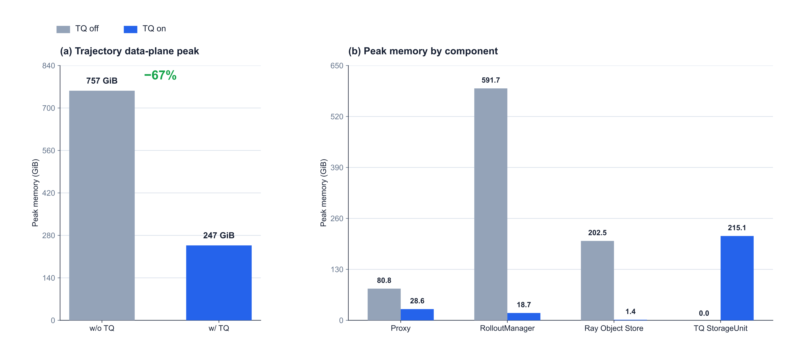
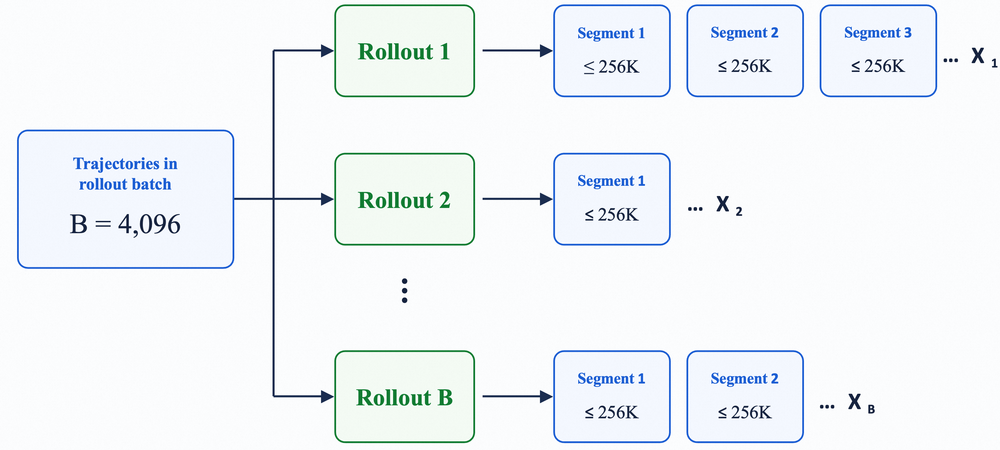
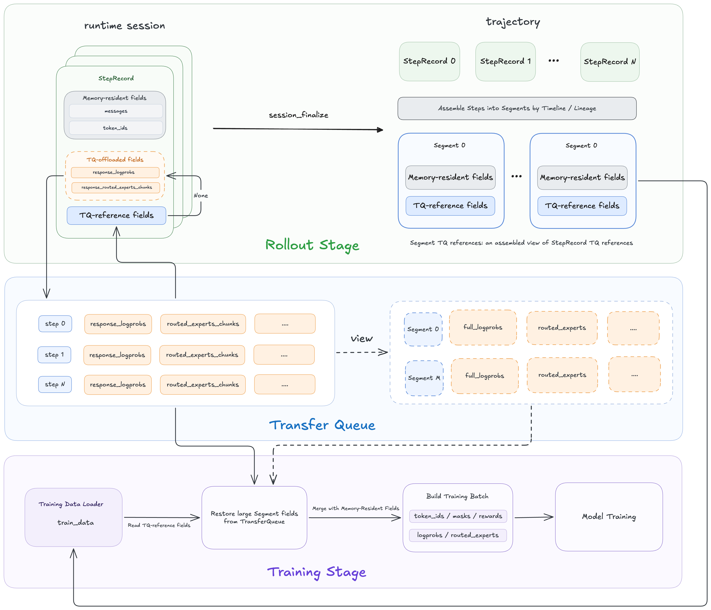
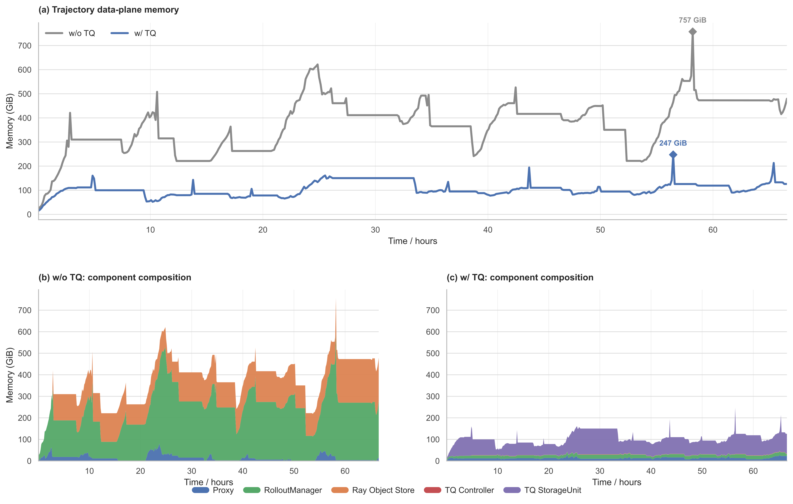
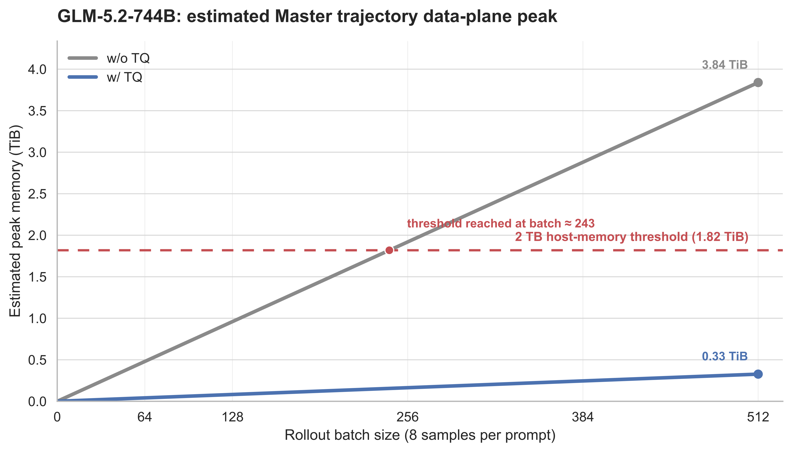

# Dressage Trajectory Storage Refactoring for Long-Context Agentic RL

Long-context Agentic RL not only increases KV Cache pressure during inference, but also significantly expands rollout trajectory storage. In particular, when an MoE model enables [Rollout Routing Replay (R3)](https://arxiv.org/abs/2510.11370), the system must record the Expert IDs selected by every MoE layer for every token. The resulting storage grows simultaneously with context length, trajectory count, model depth, and routing top-k. As contexts become longer and the number of effective training Segments increases, this data can readily grow from GiB to TiB scale.

The trajectory storage refactoring in Dressage first addresses the transfer and lifecycle of large fields. [TransferQueue](https://github.com/Ascend/TransferQueue) offloads training payloads such as `logprobs` and Expert IDs from the centralized path formed by Proxy, RolloutManager, and the Ray Object Store, and stores them in independent StorageUnits. Dressage can then use more compact data types to further reduce R3 Expert ID storage. This refactoring does not change the existing trajectory construction behavior of Dressage, and the training side ultimately receives the same data format as before.

In the two-node Qwen3.6-35B-A3B main experiment, after enabling TransferQueue and including both the TQ Controller and TQ StorageUnit, the peak memory of the trajectory data plane on the master node decreased from **757 GiB** to **247 GiB**, a reduction of approximately **67%**. The component-level results show that the benefit is not limited to Proxy: more importantly, RolloutManager and the Ray Object Store no longer continuously hold the materialized data of large trajectory fields.



*Figure 1: Capacity analysis for Qwen3.6-35B-A3B with a rollout batch size of 512 and 8 trajectories sampled per prompt. Panel (a) shows the peak memory of the trajectory data plane on the master node; panel (b) shows the independent peak of each component within the observation window.*

## 1. Motivation: Why Refactor Trajectory Storage?

### 1.1 The Fundamental Bottleneck: Long Contexts, Large Batches, and R3

An Agentic RL trajectory contains interaction data such as messages, tools, and lineage, as well as token-level fields including token IDs, `logprobs`, loss masks, token versions, and R3 Expert IDs. The first four token-level fields grow linearly with sequence length, whereas R3 must additionally record the top-k expert selections across multiple MoE layers for every token:

```math
S_{\mathrm{R3}}
= N_{\mathrm{token}}
\times L_{\mathrm{MoE}}
\times K_{\mathrm{top\text{-}k}}
\times D_{\mathrm{ExpertID}}
\times N_{\mathrm{trajectory}}
```

Consider [GLM-5.2-744B-A40B](https://huggingface.co/zai-org/GLM-5.2), with 75 MoE layers, routing top-k of 8, and int32 Expert IDs. With a Segment length of 256K, a rollout batch size of 512, and 8 trajectories sampled per prompt, the batch contains 4,096 trajectories:

```math
256\mathrm{K} \times 75 \times 8 \times 4\ \mathrm{bytes} \times 4{,}096
\approx 2.34\ \mathrm{TiB}
```

Even if each trajectory contains only one full-length Segment, the theoretical size of the R3 Expert IDs alone reaches **2.34 TiB**.

### 1.2 Amplification from Multiple Segments and Trajectory Growth Later in Training

In black-box Agent training, the context window limits what a single model invocation can observe, not the cumulative length of a complete trajectory. An Agent can compress or rewrite its history near the context limit and continue interacting. Dressage stores these phases as Segments, so one trajectory may correspond to multiple Segments that each approach the context limit.

Three concepts must be distinguished when discussing trajectory scale. A rollout session is a complete interaction that may contain multiple dialogue turns, tool calls, branches, and retries. A StepRecord records one model invocation within that session. A Segment is a trainable trajectory unit constructed from one or more StepRecords according to a timeline or lineage view; its tokens may be organized using TITO semantics, and its length is bounded by the model context window. In the figure, $`B`$ denotes the number of rollout sessions after expansion by samples per prompt. It is determined jointly by the prompt batch size and the number of samples per prompt, and is not equal to the final number of Segments.



**Figure 2:** Trajectory $`i`$ produces $`X_i`$ Segments. The final number of Segments is $`\sum_i X_i`$, rather than the expanded rollout-session count $`B`$.

Suppose a batch contains $`B`$ trajectories and trajectory $`i`$ contains $`X_i`$ Segments. The total number of active Segments is:

```math
N_{\mathrm{segment}}
= \sum_{i=1}^{B} X_i
\approx B\bar{X}
```

Here, $`\bar{X}`$ is the average number of Segments per trajectory. The context window only provides an upper bound for an individual Segment and does not determine $`\bar{X}`$. Capacity planning therefore cannot rely on “batch size × context window” alone.

For trajectories containing multiple Segments, the full Segment working set carried by the original centralized path is approximately:

```math
S_{\mathrm{R3}}
= \sum_{i=1}^{B}\sum_{j=1}^{X_i}
T_{ij} \times L \times K \times D
```

Here, $`T_{ij}`$ is the number of tokens in Segment $`j`$ of trajectory $`i`$, $`L`$ is the number of recorded layers, $`K`$ is routing top-k, and $`D`$ is the number of bytes per Expert ID.

In many Agentic RL tasks, models may perform longer reasoning, invoke more rounds of tools, or explore more steps before obtaining a successful reward as training progresses. Even with a fixed nominal rollout batch size, trajectory scale can grow along two dimensions:

1. The token count $`T_{ij}`$ of each Segment can approach the context-window limit, causing all token-level fields to grow linearly.
2. When a complete interaction crosses a context-window boundary, the number of Segments $`X_i`$ in a trajectory can increase from 1 to 2, 3, or more.

The preceding 2.34 TiB corresponds to 4,096 trajectories, each containing one full-length Segment. If every trajectory produces an average of $`\bar{X}`$ Segments that each approach 256K tokens, the theoretical size of the R3 Expert IDs is approximately:

```math
S_{\mathrm{R3}}\approx 2.34\times\bar{X}\ \mathrm{TiB}
```

In an extreme scenario where the average Segment count reaches 10, the R3 Expert IDs alone grow to approximately 23.4 TiB. If rollout production temporarily exceeds training consumption, unconsumed Segments also accumulate in the data path. A system with sufficient memory early in training may therefore still encounter OOM later as both Segment length and Segment count increase.

## 2. Problem Analysis: Why the Existing Trajectory Path Does Not Scale

### 2.1 R3 Dominates the Storage Cost of Large Trajectory Fields

R3 must precisely record the top-k expert selections of every token at every MoE layer; unlike trajectory-level metadata, it cannot be represented by a single summary. Based on the current trajectory field structure and storage format of Dressage, the theoretical storage of different fields in one Segment is estimated as follows:

| Field | R3 Expert IDs | Logprobs | Token IDs | Messages | Others |
|---|---:|---:|---:|---:|---:|
| Memory share | 92.4% | 2.3% | 2.1% | 2.3% | 0.9% |

R3 Expert IDs grow with token count, MoE layer count, and routing top-k, and account for approximately **92.4%** of the total trajectory-field storage under this configuration. By contrast, `logprobs`, token IDs, masks, and versions primarily grow only linearly with token count. Optimizing messages or ordinary token fields alone therefore cannot address the main storage pressure in long-context MoE training; R3 is the highest-priority large field in the trajectory storage refactoring.

### 2.2 The Centralized Path Retains Large Fields Repeatedly

Dressage Proxy manages sessions, records rollout steps, and constructs Segments according to lineage, timeline, and TITO semantics. In the original path, complete large fields follow the trajectory through RolloutManager and the Ray Object Store before being consumed by training:

```text
SGLang → Proxy → RolloutManager → Ray Object Store → Training
```

In a typical multi-node deployment, Proxy, RolloutManager, and the Ray head Object Store are all located on the master node. Large fields such as `logprobs` and Expert IDs are constructed, aggregated, and transferred along this path, causing the master node to hold data from multiple stages simultaneously. As the number of workers, Segment lengths, number of effective Segments, and lifecycle overlap increase, the master node reaches a high memory watermark first.

Adding workers does not naturally eliminate this problem. More workers increase rollout concurrency, but can also produce more trajectories at the same time. If large fields continue to traverse the centralized path, the active working set on the master node continues to grow.

### 2.3 Trajectories Compete with HiCache for Host Memory

[SGLang HiCache](https://github.com/sgl-project/sglang/blob/main/docs_new/docs/advanced_features/hicache_design.mdx) uses Host Memory to store KV Cache for long contexts. When HiCache and the trajectory path of Dressage are deployed on the same node, they compete for the same Host Memory: HiCache holds reusable KV Cache, while Proxy, RolloutManager, and the Ray Object Store hold trajectories that have not yet been consumed by training.

In large-batch, long-context, multi-Segment scenarios, the trajectory working set reduces the memory available to HiCache and limits the amount of KV Cache that can remain resident. Reducing centralized trajectory memory on the master node directly leaves more headroom for HiCache.

### 2.4 The General-Purpose Ray Object Path Is Ill-Suited to Sustained Large-Field Traffic

[Ray](https://www.ray.io/) maintains a shared-memory Object Store on each node to cache and transfer remote objects. Large Python objects such as trajectories must be serialized, written to the Object Store, and transferred to the consumer node in cross-node scenarios.

The current path presents three main problems:

**The general-purpose object path introduces additional data-movement overhead.** Serializing large objects, writing them into the Object Store, and transferring them across nodes continue to consume CPU, memory bandwidth, and network bandwidth. This overhead grows as fields such as `logprobs` and Expert IDs become larger.

**Large fields and control information share the same object lifecycle.** A trajectory contains both lightweight scheduling and indexing information and large training payloads. When they are packaged into one Ray object, large fields are stored, transferred, and released together with the entire object, making it difficult to manage their data path and lifecycle independently.

**Object Store capacity further constrains the data path.** When rollout continuously produces large trajectories faster than training consumes them, large objects accumulate in the Object Store. Once active objects exceed the available capacity, [object spilling](https://docs.ray.io/en/latest/ray-core/internals/object-spilling.html) may be triggered, introducing restoration overhead when those objects are consumed later.

The goal of Dressage is not to replace Ray. Ray continues to handle task scheduling, state coordination, and lightweight trajectory information, while the largest training fields reach the training side through a dedicated data channel.

## 3. Dressage Trajectory Storage Refactoring

### 3.1 Design Goals

The trajectory storage refactoring follows four goals:

1. **Reduce the memory watermark of the centralized data path.** After Proxy receives and writes large fields to TQ, those fields no longer remain materialized in StepRecord and Segment objects on Proxy, nor do they enter RolloutManager and the Ray Object Store as part of a complete trajectory.
2. **Preserve the trajectory semantics of Dressage.** Proxy continues to process create, append, branch, lineage, timeline, TITO, and partial rollout according to the existing rules.
3. **Avoid remote reads in online decisions.** During rollout and finalization, Proxy combines references without reading the corresponding large fields from TQ.
4. **Preserve training-field semantics.** The training side restores data after data-parallel sharding, and the model continues to consume the native Slime fields `rollout_log_probs` and `rollout_routed_experts`.

### 3.2 Design

#### 3.2.1 TransferQueue Changes the Data Path for Large Fields

TransferQueue divides each trajectory into two parts:

- **Trajectory organization information:** token IDs, loss masks, token versions, messages, tools, lineage, and related fields continue to be stored and transferred through the existing Dressage path.
- **Large training fields:** `logprobs` and `routed_experts` are currently supported. Proxy asynchronously writes selected fields to TQ StorageUnits according to configuration, and only references remain in their original field locations.

The refactored path is:

```text
SGLang → Proxy ──lightweight Segment──→ RolloutManager / Ray ──→ Training
                 │                                                │
                 └────logprobs / Expert ID────→ TQ ───────────────┘
```

Proxy retains the complete trajectory organization but no longer stores the materialized arrays of selected fields. RolloutManager and Ray transfer resident fields together with TQ references, and the training side batch-reads the actual data after data-parallel sharding.

#### 3.2.2 Three Stages: StepRecord, Segment, and Training



*Figure 3: Large fields are written to TransferQueue per Step; Segment construction combines only the corresponding references; the training side reads those references and restores native Slime fields.*

**StepRecord.** Responses from SGLang first arrive at Proxy. After normalizing `logprobs` and R3 data, Proxy asynchronously writes fields selected by `--transfer-params` to a TQ StorageUnit per Step, and replaces the corresponding arrays in StepRecord with references. Tokens, messages, versions, and trajectory-control state remain on Proxy. The TQ write and the local Step commit form one short commit region; if the local commit fails, the TQ key that was already written is cleared.

**Segment.** During session finalization, Proxy continues to select StepRecords according to lineage or timeline and performs the existing Segment construction. Resident fields are concatenated using the original logic. For TQ fields, Proxy combines only the reference order and token ranges; it does not read the actual data or write an additional materialized Segment to TQ. Data from the same Step can be reused by different Segment views.

**Training.** After a Segment is converted into a Sample, references to remote fields remain attached to the Sample until data-parallel sharding is complete. The TQ training Actor deduplicates and batch-reads the references for its current shard. `logprobs` are ultimately written back to the response-only Slime field `rollout_log_probs`, while R3 is restored as an int32 `rollout_routed_experts` tensor with shape `[T-1, num_layers, topk]`. The model training side observes the same field semantics as the non-TQ path.

#### 3.2.3 Field-Level Enablement and Compatibility

TransferQueue is disabled by default. When enabled, `--transfer-params` selects `logprobs`, `routed_experts`, or both for offload. Offloading R3 also requires Rollout Routing Replay to be enabled:

```bash
--use-rollout-routing-replay \
--enable-transfer-queue \
--transfer-queue-config examples/scripts/default/dressage_transfer_queue.yaml \
--transfer-params logprobs routed_experts
```

Fields that are not selected continue to use the original in-memory Dressage path. When TQ is disabled, all fields follow the original path. Online append, branch, lineage matching, and version-span decisions on Proxy do not read TQ, and RolloutManager continues to use the existing trajectory-read interface. The training side restores remote fields through dedicated TQ training entry points without modifying the Slime data structure.

#### 3.2.4 Further Optimization: Compact Types for R3

Expert IDs are non-negative integers, so their storage width only needs to cover the actual expert-index range of the model. Dressage selects the R3 Expert ID storage type through:

```bash
--routed-experts-dtype uint16
```

The currently supported types are `uint8`, `uint16`, and `int32`, with `int32` as the default. Compared with `int32`, `uint16` reduces the raw binary width of the Expert ID payload by 50%, while `uint8` reduces it by 75%. Before writing, Dressage checks whether an Expert ID exceeds the range of the target type to prevent silent truncation.

Compact types are independent of TransferQueue. With TQ disabled, they still reduce the size of R3 chunks on Proxy. When combined with TQ, they also reduce the amount of data written to StorageUnits and read back later. During training, R3 is always restored to the original int32 tensor representation, preserving the algorithmic semantics of Rollout Routing Replay.

## 4. Evaluation

### 4.1 Experimental Setup and Measurement Methodology

The experiment uses Qwen3.6-35B-A3B and synchronous GRPO training on two nodes with 8 GPUs per node. The main configuration is:

| Configuration | Value |
|---|---:|
| Model | Qwen3.6-35B-A3B |
| Compute resources | 2 × 8 GPUs |
| Context length | 64K |
| Training algorithm | Synchronous GRPO |
| Rollout batch size | 512 |
| Samples per prompt | 8 |
| Expanded trajectory count | 4,096 |
| Fields offloaded to TQ | `logprobs`, `routed_experts` |

Process memory is measured using PSS, while Ray Object Store memory uses the actual used capacity returned by the monitoring interface. The trajectory data plane on the master node is defined as:

```math
M_{\mathrm{Master}} = M_{\mathrm{Proxy}}^{\mathrm{PSS}} + M_{\mathrm{RolloutManager}}^{\mathrm{PSS}} + M_{\mathrm{ObjectStore,Master}}^{\mathrm{PSS}} + M_{\mathrm{TQController}}^{\mathrm{PSS}} + M_{\mathrm{TQStorageUnit}}^{\mathrm{PSS}}
```

This metric excludes model weights, training processes, CUDA memory, and HiCache.

### 4.2 Overall Trajectory Data-Plane Memory and Component Changes

In the target scenario, enabling TransferQueue reduced the peak memory of the trajectory data plane on the master node from **757 GiB** to **247 GiB**, a reduction of approximately **67%**. The timeline shows that, without TQ, the trajectory data plane remains at a high memory watermark and repeatedly accumulates and releases memory as trajectories are generated, aggregated, and consumed by training. With TQ enabled, the overall curve stays within a substantially lower range and exhibits only a small number of short-lived peaks. Field offload therefore reduces not only the maximum peak but also the sustained residency of large fields along the rollout-to-training path.



*Figure 4: Capacity analysis of the trajectory data plane on the master node for the Qwen 512 × 8 target scenario.*

Without TransferQueue, large fields such as `logprobs` and R3 Expert IDs enter RolloutManager and the Ray Object Store together with the complete trajectory, keeping the trajectory data plane at a high memory watermark. With TransferQueue enabled, Proxy retains trajectory organization fields such as tokens, masks, versions, messages, and lineage, together with TQ references, while the actual large-field data is stored in TQ StorageUnits. As a result, the peak memory of Proxy, RolloutManager, and the Ray Object Store decreases substantially:

| Component | w/o TQ | w/ TQ | Change |
|---|---:|---:|---:|
| Proxy | 80.8 GiB | 28.6 GiB | -64.6% |
| RolloutManager | 591.7 GiB | 18.7 GiB | -96.8% |
| Ray Object Store | 202.5 GiB | 1.4 GiB | -99.3% |
| TQ StorageUnit | 0 GiB | 215.1 GiB | New independent data storage |

Although TransferQueue introduces StorageUnit memory usage, the aggregate peak of the trajectory data plane at any given moment remains substantially lower. Field-level offload reduces repeated retention of large fields across Proxy, RolloutManager, and the Ray Object Store. The primary benefit therefore comes from the complete rollout-to-training data path rather than only from a local reduction in Proxy memory.

### 4.3 Capacity Trends for Large-Model Training

To analyze the scalability of the trajectory storage refactoring for larger models and longer contexts, we use the GLM5.2-744B-A40B configuration as a reference and further estimate the peak memory of the trajectory data plane on the master node in a 32-node large-scale RL training setup. The target configuration uses a 256K context, samples 8 trajectories per prompt, and distributes TQ StorageUnits across 32 nodes.

The projection uses the Qwen3.6-35B-A3B main experiment, with rollout batch size 512 and 64K context, as its baseline. Ordinary token fields are scaled by context length, while R3 Expert IDs additionally account for the change in model layer count. The TQ path further accounts for data sharding as StorageUnits scale from a two-node deployment to 32 nodes. The estimate covers only Proxy, RolloutManager, the Ray Object Store, the TQ Controller, and the local TQ StorageUnit on the master node; it excludes model weights, training processes, and HiCache.

The context length grows from 64K in the main experiment to 256K, while the number of recorded R3 layers grows from 40 to 75. The total cluster-wide R3 size is therefore approximately 7.5 times that of the main experiment. Without TQ, the enlarged trajectory data still flows centrally through the master node. With TQ, R3 is sharded across 32 StorageUnits. Relative to the two StorageUnits in the two-node main experiment, the incremental R3 load handled by the local StorageUnit on the master node in the GLM scenario is approximately 0.47 times the original load.

<div align="center">
  
</div>

*Figure 5: Capacity analysis of the trajectory data plane on the master node for the target GLM-5.2 configuration.*

For common 8 × H100 server configurations, 2 TB (1.82 TiB) is a representative high-capacity Host Memory configuration. At a rollout batch size of 512, the peak master-node data-plane memory without TQ is projected to be approximately 3.84 TiB, exceeding the 2 TB Host Memory threshold; the curve reaches that threshold at a batch size of approximately 243. With TQ enabled, Expert IDs stored as uint16, and 32 StorageUnits distributed across the nodes, the projected peak master-node data-plane memory is approximately 0.33 TiB.

This projection also illustrates the scalability of TransferQueue in large clusters. Without TQ, the trajectory working set remains concentrated on the master node as rollout scale increases. TQ can scale storage capacity with the node count and distribute large fields across multiple StorageUnits. As the cluster grows, the fraction of data carried by the master node can therefore decrease instead of forcing the master to retain the complete trajectory data. This capability prevents the memory limit of large-batch, long-context training from being dominated by a single master node.

## 5. Conclusion

Trajectory scale in long-context Agentic RL cannot be estimated simply as “context window × rollout batch size.” The context window bounds only an individual Segment, while one complete rollout can produce multiple Segments. As training progresses, both Segment length and Segment count can continue to grow, further increasing total token count, the in-flight trajectory working set, and OOM risk.

Dressage introduces TransferQueue to decouple trajectory organization information from the data path of large training fields. Proxy continues to manage trajectory organization and the semantics of lineage, timeline, TITO, and partial rollout, while `logprobs` and R3 Expert IDs are written to TQ StorageUnits. The training side restores the original tensors from references, preserving the data semantics consumed by model training.

In the two-node main experiment, the peak memory of the trajectory data plane on the master node decreased from **757 GiB** to **247 GiB**, a reduction of approximately **67%**. The component-level results show that the benefit is not limited to Proxy: more importantly, RolloutManager and the Ray Object Store no longer continuously hold the materialized data of large trajectory fields.

The large-model capacity analysis further shows that TransferQueue can distribute large fields across more nodes by adding StorageUnits, reducing the pressure caused by trajectories continuously concentrating on the master node. This refactoring transforms trajectory storage from a single-node memory working set into a horizontally scalable data path, providing a more scalable storage foundation for Agentic RL training with longer contexts and larger rollout batches.

**References**

1. [TransferQueue](https://github.com/Ascend/TransferQueue)
2. [SGLang HiCache](https://github.com/sgl-project/sglang/blob/main/docs_new/docs/advanced_features/hicache_design.mdx)
3. [Ray](https://www.ray.io/)
4. [Stabilizing MoE Reinforcement Learning by Aligning Training and Inference Routers](https://arxiv.org/abs/2510.11370)
