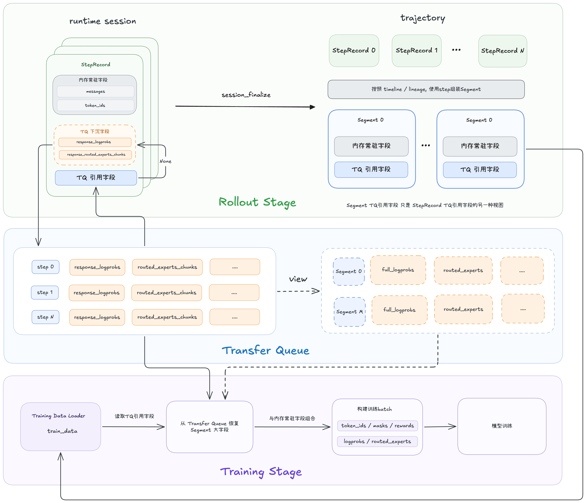

# 面向长上下文 Agentic RL 的 Dressage 轨迹存储重构


⻓上下⽂ Agentic RL 不只增加推理阶段的 KV Cache 压⼒，也会显著放⼤ rollout trajectory 的存储规模。特别是在 MoE
模型开启 [Rollout Routing Replay（R3）](https://arxiv.org/abs/2510.11370) 后，系统需要为每个 token 记录各个 MoE 层选择的 Expert ID，其存储规模会随上下文长度、轨迹数量、模型层数和 routing top-k 同时增长。上下⽂越⻓、有效训练 Segment 越多，这部分数据就越容易从 GiB 增⻓到 TiB。

Dressage 的轨迹存储重构⾸先解决⼤字段的传输和⽣命周期问题：引入 [TransferQueue](https://github.com/Ascend/TransferQueue) 将 `logprobs`、Expert ID 等训练
payload 从 Proxy、RolloutManager 和 Ray Object Store 构成的集中式路径中下沉，由独⽴的 StorageUnit 承载。随后允许使⽤更紧凑的数据类型进⼀步压缩 R3 Expert ID。重构不会改变 Dressage 原有的 trajectory 构建⽅式，
训练侧最终拿到的数据格式也保持不变。

在 Qwen3.6-35B-A3B 双机主实验场景中，启用 TransferQueue 并计入 TQ Controller 和 TQ StorageUnit 后，Master 轨迹数据面峰值仍从 **757 GiB** 降至 **247 GiB**，下降约 **67%**。组件结果表明，收益并不局限于 Proxy，更主要的变化是 RolloutManager 和 Ray Object Store 不再持续承载轨迹大字段的实体数据。


*图 1：Qwen3.6-35B-A3B 在 rollout batch size 为 512、每个 prompt 采样 8 条轨迹的目标场景下的容量分析。图（a）为 Master 轨迹数据面峰值；图（b）为各组件在统计窗口内的独立峰值。*

## 1. Motivation：为什么需要重构轨迹存储

### 1.1 基础瓶颈：长上下文、大 Batch 与 R3

Agentic RL 的 trajectory 同时包含 messages、tools 和 lineage 等交互信息，以及 token IDs、`logprobs`、loss mask、token versions 和 R3 Expert ID 等 token 级字段。前四类 token 级字段随序列长度线性增长；R3 还要为每个 token 记录多个 MoE 层上的 top-k 专家选择：

```math
S_{\mathrm{R3}}
= N_{\mathrm{token}}
\times L_{\mathrm{MoE}}
\times K_{\mathrm{top\text{-}k}}
\times D_{\mathrm{ExpertID}}
\times N_{\mathrm{trajectory}}
```

以 [GLM-5.2-744B-A40B](https://huggingface.co/zai-org/GLM-5.2) 为例，按 75 个 MoE 层、routing top-k 为 8、Expert ID 使用 int32 计算，当单个 Segment 长度为 256K、rollout batch size 为 512、每个 prompt 采样 8 条轨迹时，batch 中共有 4,096 条轨迹：

```math
256\mathrm{K} \times 75 \times 8 \times 4\ \mathrm{bytes} \times 4{,}096
\approx 2.34\ \mathrm{TiB}
```

即使每条 trajectory 只有一个满长 Segment，仅 R3 Expert ID 的理论数据量也已达到 **2.34 TiB**。

### 1.2 多 Segment 与训练后期的轨迹规模放大

在黑盒 Agent 训练中，上下文窗口限制的是一次模型调用可见的内容，而不是完整 trajectory 的累计长度。Agent 可以在接近窗口上限后压缩或重写历史并继续交互；Dressage 以 Segment 保存这些阶段性轨迹，因此一条 trajectory 可能对应多个接近上下文上限的 Segment。

讨论轨迹规模时，需要先区分三个概念：rollout session 表示一次可能包含多轮对话、工具调用、分支和重试的完整交互；StepRecord 记录其中一次模型调用；Segment 则是由一个或多个 StepRecord 按 timeline 或 lineage 视图构建的可训练轨迹单元，其 token 组织可以采用 TITO 语义，长度受模型 context window 限制。图中的 $`B`$ 表示按 samples per prompt 展开后的 rollout session 数量，由 prompt batch size 与每个 prompt 的采样数共同决定，并不等于最终生成的 Segment 数量。


**图 2：** 第 $`i`$ 条 trajectory 产生 $`X_i`$ 个 Segment，最终 Segment 数为 $`\sum_i X_i`$，而不是展开后的 rollout session 数 $`B`$。

设 batch 中有 $`B`$ 条 trajectory，第 $`i`$ 条 trajectory 包含 $`X_i`$ 个 Segment，则活跃 Segment 总数为：

```math
N_{\mathrm{segment}}
= \sum_{i=1}^{B} X_i
\approx B\bar{X}
```

其中，$`\bar{X}`$ 是每条 trajectory 的平均 Segment 数。上下文窗口只能给出单个 Segment 的上界，无法直接给出 $`\bar{X}`$，因此容量规划不能简单使用“batch size × context window”。

对于包含多个 Segment 的 trajectory，原集中式路径需要承载的完整 Segment 工作集近似为：

```math
S_{\mathrm{R3}}
= \sum_{i=1}^{B}\sum_{j=1}^{X_i}
T_{ij} \times L \times K \times D
```

其中，$`T_{ij}`$ 是第 $`i`$ 条 trajectory 的第 $`j`$ 个 Segment 的 token 数，$`L`$ 是记录的层数，$`K`$ 是 routing top-k，$`D`$ 是单个 Expert ID 的字节数。

在不少 Agentic RL 任务中，随着训练推进，模型可能进行更长的推理、调用更多轮工具，或者在获得成功奖励前探索更多步骤。即使名义 rollout batch size 保持不变，轨迹规模仍可能从两个维度增长：

1. 单个 Segment 的 token 数 $`T_{ij}`$ 逐渐接近 context window 上限，使所有 token 级字段线性增长；
2. 当完整交互跨越 context window 边界时，单条 trajectory 的 Segment 数 $`X_i`$ 可能从 1 增加到 2、3，甚至更多。

前述 2.34 TiB 对应 4,096 条轨迹各包含一个满长 Segment 的情况。如果每条 trajectory 平均产生 $`\bar{X}`$ 个接近 256K 的 Segment，则 R3 Expert ID 的理论数据规模近似为：

```math
S_{\mathrm{R3}}\approx 2.34\times\bar{X}\ \mathrm{TiB}
```

在极端场景下，若平均 Segment 数达到 10，仅 R3 Expert ID 的数据规模就会增长至约 23.4 TiB。如果 rollout 的生产速度暂时超过 training 的消费速度，未消费的 Segment 还会在数据链路中积压。因此，一个在训练早期内存充足的系统，仍可能随着 Segment 长度和数量增长，在训练后期发生 OOM。

## 2. 问题分析：现有轨迹路径为什么难以扩展

### 2.1 R3 主导轨迹大字段开销

R3 需要精确记录每个 token 在各个 MoE 层上的 top-k 专家选择，无法像轨迹级 metadata 一样只保存一份摘要。下面基于 Dressage 当前的 trajectory 字段结构与存储格式估算，对单个 Segment 中各类字段的理论存储量进行拆分：

| 字段 | R3 Expert IDs | Logprobs | Token IDs | Messages | Others |
|---|---:|---:|---:|---:|---:|
| 内存占比 | 92.4% | 2.3% | 2.1% | 2.3% | 0.9% |

R3 Expert ID 同时随 token 数、MoE 层数和 routing top-k 增长，在该配置下约占轨迹字段总存储量的 **92.4%**。相比之下，`logprobs`、token IDs、mask 和 version 等字段主要只随 token 数线性增长。因此，仅优化 messages 或普通 token 字段难以缓解长上下文 MoE 训练的主要存储压力，R3 是轨迹存储重构中优先级最高的大字段。

### 2.2 集中式路径会重复持有大字段

Dressage Proxy 负责 session 管理、rollout step 记录，以及 lineage、timeline 和 TITO 语义下的 Segment 构建。原有路径中，完整大字段随 trajectory 依次进入 RolloutManager 和 Ray Object Store，再交给训练侧消费：

```text
SGLang → Proxy → RolloutManager → Ray Object Store → Training
```

在常⻅的多机部署中，Proxy、RolloutManager 和 Ray head Object Store 都位于 master。 logprobs、Expert ID 等⼤
字段沿这条路径被构建、聚合和传递，使 master 同时承载多个阶段的数据。随着 worker 数量、Segment ⻓度、有效
Segment 数和⽣命周期重叠程度增加，master 会⾸先出现内存⾼⽔位。

增加 worker 不会让这个问题⾃然消失。新增 worker 可以提⾼ rollout 并发，却也可能同时产⽣更多 trajectory；如果⼤字段仍沿集中式路径传递，master 上的活跃⼯作集仍会继续增⻓。

### 2.3 Trajectory 与 HiCache 竞争 Host Memory

[SGLang HiCache](https://github.com/sgl-project/sglang/blob/main/docs_new/docs/advanced_features/hicache_design.mdx) 使⽤ Host Memory 保存⻓上下⽂的 KV Cache。当 HiCache 与 Dressage 的轨迹链路部署在相同节点时，两者会竞争同⼀份 Host Memory：HiCache 保存可复⽤的 KV Cache，⽽ Proxy、RolloutManager 和 Ray Object
Store 保存尚未被训练消费的 trajectory。

在⼤ batch、⻓上下⽂和多 Segment 场景下，trajectory ⼯作集会压缩 HiCache 可⽤空间，限制可承载的 KV Cache 容
量。降低 trajectory 在 master 上的集中式内存占⽤，可以直接为 HiCache 释放更多余量。

### 2.4 通用 Ray Object 路径不适合持续承载大字段

[Ray](https://www.ray.io/) 在各节点维护共享内存 Object Store，用于缓存和传递远程对象。对于 trajectory 这类大型 Python 对象，数据需要经过序列化、写入 Object Store，并在跨节点场景下传输到消费节点。

当前路径主要面临三个问题：

**通用对象路径带来额外的数据搬运开销。** 大对象的序列化、Object Store 写入和跨节点传输会继续消耗 CPU、内存带宽与网络带宽；`logprobs` 和 Expert ID 越大，这部分开销越明显。

**大字段与控制信息共享同一对象生命周期。** trajectory 同时包含轻量的调度、索引信息，以及大规模训练 payload。当它们被封装为同一个 Ray object 时，大字段随整个对象一起存储、传输和释放，难以单独管理数据路径与生命周期。

**Object Store 容量会进一步限制数据通路。** 当 rollout 持续生产大型 trajectory 且速度高于 training 消费速度时，大对象会在 Object Store 中积压；活跃对象超过可用容量后，可能触发 [object spilling](https://docs.ray.io/en/latest/ray-core/internals/object-spilling.html)，并在后续消费时引入恢复开销。

Dressage 的目标不是替换 Ray。Ray 继续负责任务调度、状态协调和轻量轨迹信息的传递，而占用最大的训练字段通过专用数据通道进入训练侧。

## 3. Dressage 的轨迹存储重构

### 3.1 设计目标

轨迹存储重构遵循四个目标：

1. **降低集中式数据路径的内存水位。** 大字段由 Proxy 接收并写入 TQ 后，不再作为 StepRecord 和 Segment 的实体字段常驻 Proxy，也不再随完整 trajectory 进入 RolloutManager 和 Ray Object Store。
2. **保留 Dressage 的轨迹语义。** create、append、branch、lineage、timeline、TITO 和 partial rollout 继续由 Proxy 按原有规则处理。
3. **避免在线判断依赖远程读取。** Proxy 在 rollout 和 finalize 阶段只组合引用，不读取 TQ 中的大字段。
4. **保持训练字段语义一致。** 训练侧在 data-parallel 分片后恢复数据，模型仍消费 Slime 原有的 `rollout_log_probs` 和 `rollout_routed_experts`。

### 3.2 方案设计

#### 3.2.1 TransferQueue 改变大字段的数据路径

TransferQueue 将 trajectory 拆分为两个部分：

- **轨迹组织信息**：token IDs、loss mask、token versions、messages、tools 和 lineage 等，继续沿 Dressage 原有路径保存和传递；
- **训练大字段**：当前支持 `logprobs` 和 `routed_experts`，由 Proxy 按配置异步写入 TQ StorageUnit，原字段位置只保存引用。

重构后的路径为：

```text
SGLang → Proxy ──轻量 Segment──→ RolloutManager / Ray ──→ Training
                 │                                        │
                 └────logprobs / Expert ID──→ TQ ─────────┘
```

Proxy 仍然掌握完整的轨迹组织关系，但不再持有被选中字段的实际数组。RolloutManager 和 Ray 传递的是常驻字段及 TQ 引用，训练侧再按当前 data-parallel 分片批量读取实际数据。

#### 3.2.2 StepRecord、Segment 与 Training 三阶段



*图 3：大字段按 Step 写入 TransferQueue；Segment 只组合对应引用；训练侧读取引用并恢复 Slime 原生字段。*

**StepRecord。** SGLang 的响应首先到达 Proxy。Proxy 完成 `logprobs` 和 R3 数据的规范化后，将 `--transfer-params` 选中的字段按 Step 异步写入 TQ StorageUnit，再把 StepRecord 中相应数组替换为引用。token、messages、versions 及轨迹控制状态继续保留在 Proxy。写入 TQ 与本地 Step 提交构成同一个短提交区间；本地提交失败时会清理已经写入的 TQ key。

**Segment。** session finalize 时，Proxy 继续按照 lineage 或 timeline 选择 StepRecord，并执行原有的 Segment 构建。常驻字段按原逻辑拼接；TQ 字段只组合引用对应的顺序和 token 区间，不读取实际数据，也不会在 TQ 中额外写入一份完整 Segment。同一 Step 的数据可以被不同 Segment 视图复用。

**Training。** Segment 转为 Sample 后，远端字段引用随 Sample 保留到 data-parallel 分片完成。TQ 训练 Actor 对当前分片的引用进行去重和批量读取：`logprobs` 最终写回 Slime 的 response-only `rollout_log_probs`，R3 恢复为 `[T-1, num_layers, topk]` 的 int32 `rollout_routed_experts`。模型训练侧看到的字段语义与非 TQ 路径一致。

#### 3.2.3 字段级启用与兼容性

TransferQueue 默认关闭。开启时，通过 `--transfer-params` 选择下沉 `logprobs`、`routed_experts` 或两者。下沉 R3 必须同时启用 Rollout Routing Replay：

```bash
--use-rollout-routing-replay \
--enable-transfer-queue \
--transfer-queue-config examples/scripts/default/dressage_transfer_queue.yaml \
--transfer-params logprobs routed_experts
```

未被选中的字段继续使用 Dressage 原有内存路径；TQ 关闭时，所有字段都使用原路径。Proxy 的在线 append、branch、lineage matching 和 version-span 判断不读取 TQ；RolloutManager 继续使用原有 trajectory 读取接口。训练侧通过专用 TQ 训练入口恢复字段，不需要修改 Slime 的数据结构。

#### 3.2.4 进一步优化：用紧凑类型降低 R3 成本

Expert ID 是非负整数，其存储宽度只需覆盖模型实际的专家编号。Dressage 通过以下参数选择 R3 Expert ID 的存储类型：

```bash
--routed-experts-dtype uint16
```

当前支持 `uint8`、`uint16` 和 `int32`，默认使用 `int32`。与 `int32` 相比，`uint16` 将 Expert ID 原始二进制负载宽度减少 50%，`uint8` 减少 75%。Dressage 在写⼊前检查 Expert ID 是否超出⽬标类型范围，避免数据被静默截断。

紧凑类型与 TransferQueue 相互独立：关闭 TQ 时，它同样可以降低 Proxy 中 R3 chunk 的大小；与 TQ 联用时，还会进一步降低写入 StorageUnit 和后续读取的数据量。训练阶段统一恢复为 R3 原有的 int32 tensor，不改变 Rollout Routing Replay 的算法语义。

## 4. 实验评估

### 4.1 实验设置与统计口径

实验采⽤ Qwen3.6-35B-A3B，在 2 个节点、每节点 8 张 GPU 的环境中进⾏同步 GRPO 训练。主要配置如下：

| 配置项 | 设置 |
|---|---:|
| 模型 | Qwen3.6-35B-A3B |
| 计算资源 | 2 × 8 GPU |
| 上下文长度 | 64K |
| 训练算法 | 同步 GRPO |
| Rollout batch size | 512 |
| Samples per prompt | 8 |
| 展开后的轨迹数 | 4,096 |
| TQ 下沉字段 | `logprobs`、`routed_experts` |

进程内存采用 PSS，Ray Object Store 使用监控接口返回的实际已用容量。本文将 Master 轨迹数据面定义为：

```math
M_{\mathrm{Master}} = M_{\mathrm{Proxy}}^{\mathrm{PSS}} + M_{\mathrm{RolloutManager}}^{\mathrm{PSS}} + M_{\mathrm{ObjectStore,Master}}^{\mathrm{PSS}} + M_{\mathrm{TQController}}^{\mathrm{PSS}} + M_{\mathrm{TQStorageUnit}}^{\mathrm{PSS}}
```

该指标不包括模型权重、训练进程、CUDA memory 和 HiCache。

### 4.2 轨迹数据面的总体内存与组件变化

在目标场景中，启用 TransferQueue 后，Master 轨迹数据面峰值由 **757 GiB** 降至 **247 GiB**，下降约 **67%**。从时间曲线看，未启用 TQ 时，轨迹数据面长期处于较高水位，并随着轨迹生成、聚合和训练消费呈现多次累积与释放；启用 TQ 后，整体曲线稳定在更低区间，仅出现少量短时峰值。这表明字段下沉不仅降低了单次峰值，也减少了大字段在 rollout-to-training 链路中的持续驻留。


*图 4：Qwen 512 × 8 目标场景下的 Master 轨迹数据面容量分析。*

关闭 TransferQueue 时，`logprobs` 和 R3 Expert ID 等大字段随完整轨迹进入 RolloutManager 和 Ray Object Store，使轨迹数据面长期处于较高水位。开启 TransferQueue 后，Proxy 保留 token、mask、version、messages、lineage 等轨迹组织字段以及 TQ 引用，大字段的实际数据则由 TQ StorageUnit 承载。因此，Proxy、RolloutManager 和 Ray Object Store 的内存峰值均明显下降：

| 组件 | w/o TQ | w/ TQ | 变化 |
|---|---:|---:|---:|
| Proxy | 80.8 GiB | 28.6 GiB | -64.6% |
| RolloutManager | 591.7 GiB | 18.7 GiB | -96.8% |
| Ray Object Store | 202.5 GiB | 1.4 GiB | -99.3% |
| TQ StorageUnit | 0 GiB | 215.1 GiB | 新增独立数据存储 |

虽然 TransferQueue 引入了 StorageUnit 的内存开销，但同一时刻的轨迹数据面总体峰值仍显著降低。这说明字段级下沉减少了大字段在 Proxy、RolloutManager 和 Ray Object Store 之间的重复持有，主要收益来自整个 rollout-to-training 数据路径，而不只是 Proxy 的局部内存下降。

### 4.3 大模型训练场景下的容量趋势

为了分析轨迹存储重构在更⼤模型和更⻓上下⽂下的扩展性，我们以 GLM5.2-744B-A40B 的配置为基准，进⼀步估算在 32 节点⼤
规模 RL 训练中的 Master 轨迹数据⾯峰值。⽬标配置使⽤ 256K 上下⽂、每个 prompt 采样 8 条轨迹，并在 32 个节点上分布 TQ StorageUnit。

预测以本⽂ Qwen3.6-35B-A3B 主实验的 rollout batch size 为 512、64K 上下⽂结果为基线。普通 token 字段按照上下⽂⻓度缩放，R3 Expert ID 额外考虑模型层数变化；TQ 路径则进⼀步考虑 StorageUnit 从双机扩展到32节点后的数据分⽚。估算仅覆盖Master 上的 Proxy、RolloutManager、Ray Object Store、TQ Controller 和本地 TQ StorageUnit，不包含模型权重、训练进程 和 HiCache。

上下⽂⻓度由主实验的64K增加到256K，R3 记录层数由40层增加到75层，因此集群 R3 总规模约为主实验的7.5倍。不开启 TQ
时，增⻓后的轨迹数据仍集中经过 Master；开启 TQ 后，R3 由32个 StorageUnit 分⽚承载。相对于双机主实验中的2个
StorageUnit，GLM 场景下 Master 本地 StorageUnit 承担的 R3 增量约为原来的0.47倍。

<div align="center">
  
</div>

*图 5：GLM-5.2 目标配置下的 Master 轨迹数据面容量分析。*

在常见的 8 × H100 服务器配置中，2 TB（1.82 TiB）是较为典型的高容量配置。 在 rollout batch size 为512时，不开启 TQ 的 Master 数据⾯峰值预计约为 3.84 TiB，超过2 TB主机内存阈值；按照曲线估计，其在 batch size 约为 243 时达到该阈值。开启 TQ、使⽤ uint16 保存 Expert ID，并将32个 StorageUnit 分布到各节点后，Master数据⾯峰值预计约为 0.33 TiB。

这⼀预测也从侧⾯反映了 TransferQueue 在⼤规模集群中的扩展性：⾮ TQ 路径的轨迹⼯作集随 rollout 规模持续集中到
Master，⽽ TQ 可以随节点数增加同步扩展存储能⼒，将⼤字段分散到多个 StorageUnit。因⽽，集群规模扩⼤时，Master 承担
的数据⽐例能够下降，⽽不是继续承载完整轨迹数据。这种能⼒使⼤ batch、⻓上下⽂训练的内存上限不再主要受单个 Master 节点约束。

## 5. 结论

长上下文 Agentic RL 的轨迹规模不能简单使用“context window × rollout batch size”估计。Context window 只约束单个 Segment，一次完整 rollout 可以产生多个 Segment；随着训练推进，Segment 的长度和数量还可能继续增长，使总 token 数、在途轨迹工作集和 OOM 风险进一步上升。

Dressage 引入 TransferQueue，将轨迹组织信息与训练大字段的数据路径解耦。Proxy 继续负责 trajectory 组织以及 lineage、timeline、TITO 和 partial rollout 语义，`logprobs` 和 R3 Expert ID 则写入 TQ StorageUnit；训练侧根据引用恢复原有 tensor，因此模型训练所使用的数据语义保持不变。

在双机主实验场景中，Master 轨迹数据面峰值从 **757 GiB** 降至 **247 GiB**，下降约 **67%**。组件结果表明，收益并不局限于 Proxy，更主要的变化是 RolloutManager 和 Ray Object Store 不再持续承载轨迹大字段的实体数据。

大模型场景下的容量分析进一步表明，TransferQueue 可以通过增加 StorageUnit 将大字段分散到更多节点，降低轨迹数据持续集中到 Master 的压力。该重构将轨迹存储从单点内存工作集转变为可横向扩展的数据路径，为更长上下文和更大 rollout batch 的 Agentic RL 训练提供了更可扩展的存储基础。

**参考资料**

1. [TransferQueue](https://github.com/Ascend/TransferQueue)
2. [SGLang HiCache](https://github.com/sgl-project/sglang/blob/main/docs_new/docs/advanced_features/hicache_design.mdx)
3. [Ray](https://www.ray.io/)
4. [Stabilizing MoE Reinforcement Learning by Aligning Training and Inference Routers](https://arxiv.org/abs/2510.11370)
